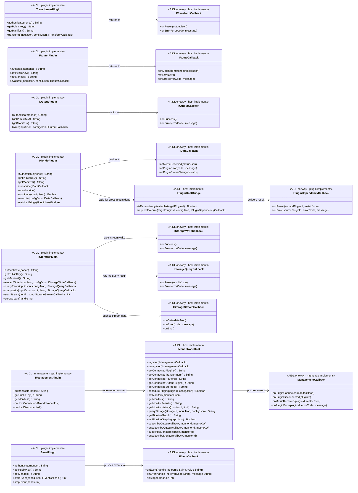
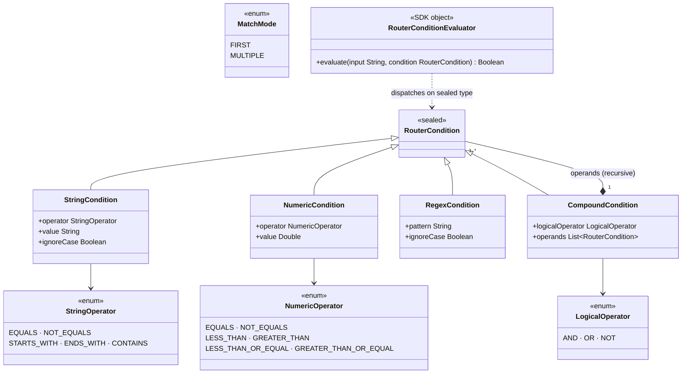
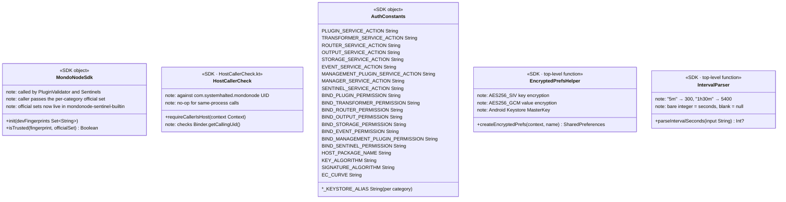

# mondonode-sdk — Architecture

## 1. Base Service Class Hierarchy

Each plugin category extends one abstract base class from the SDK. The base class handles Keystore key generation, nonce signing, `IBinder.linkToDeath()` wiring, and per-call UID validation via `requireCallerIsHost()`.

```mermaid
classDiagram
    direction TB

    class Service {
        <<Android>>
        +onBind(intent) IBinder
    }

    class PluginServiceBase {
        <<SDK · abstract>>
        #hostBridge IPluginHostBridge?
        +onBind(intent) IBinder
        #onGetManifest()* PluginManifest
        #onSubscribe(callback IDataCallback)*
        #onUnsubscribe()*
        #onConfigure(configJson String) Boolean*
        #onExecute(configJson String, callback IDataCallback)*
        #onHostBridgeDied() open
        -generateOrLoadKeyPair()
        -signNonce(nonce) String
    }

    class TransformerServiceBase {
        <<SDK · abstract>>
        +onBind(intent) IBinder
        #onGetManifest()* TransformerManifest
        #onTransform(capabilityId, inputValue, parameters, callback)*
    }

    class RouterServiceBase {
        <<SDK · abstract>>
        +onBind(intent) IBinder
        #onGetManifest()* RouterManifest
        #onEvaluate(capabilityId, inputValue, conditions, matchMode, callback)*
    }

    class OutputServiceBase {
        <<SDK · abstract>>
        +onBind(intent) IBinder
        #onGetManifest()* OutputManifest
        #onWrite(capabilityId, inputValues, parameters, callback)*
    }

    class StorageServiceBase {
        <<SDK · abstract>>
        +onBind(intent) IBinder
        #onGetManifest()* StorageManifest
        #onStreamWrite(capabilityId, inputValues, parameters, callback)*
        #onQueryRead(capabilityId, inputValues, parameters, callback)*
        #onQueryWrite(capabilityId, inputValues, parameters, callback)*
        #onStartStream(capabilityId, parameters, callback) Int open
        #onStopStream(handle Int) open
    }

    class ManagementServiceBase {
        <<SDK · abstract>>
        +onBind(intent) IBinder
        #onGetManifest()* ManagementPluginManifest
        #onHostConnected(host IMondoNodeHost)*
        #onHostDisconnected()*
        -hostDeathRecipient IBinder.DeathRecipient
    }

    class EventServiceBase {
        <<SDK · abstract>>
        +onBind(intent) IBinder
        #onGetManifest()* EventManifest
        #onStartEvent(capabilityId String, parameters Map~String,String~, callback IEventCallback)* Int
        #onStopEvent(handle Int)*
    }

    Service <|-- PluginServiceBase
    Service <|-- TransformerServiceBase
    Service <|-- RouterServiceBase
    Service <|-- OutputServiceBase
    Service <|-- StorageServiceBase
    Service <|-- ManagementServiceBase
    Service <|-- EventServiceBase
```

---

## 2. AIDL Interface Pairs

Every category uses one plugin-side interface (implemented by the APK, called by the host) and one or more host-side callbacks (implemented by the host, declared `oneway`).

---

## 3. Manifest and Capability Types

Each plugin category has a manifest type (returned by `getManifest()`) and one or more capability types.

```mermaid
classDiagram
    direction TB

    class PluginManifest {
        +pluginId String
        +name String
        +version String
        +author String
        +description String
        +capabilities List~PluginCapability~
        +publicKeyBase64 String
        +pluginDependencies List~PluginDependency~
    }
    class PluginCapability {
        +id String
        +name String
        +description String
        +type PluginCapabilityType
        +parameters List~PluginParameterSpec~
        +inputQueueMode InputQueueMode
        +inputPorts List~PortSpec~
        +outputPorts List~PortSpec~
    }
    PluginManifest "1" *-- "1..*" PluginCapability

    class TransformerManifest {
        +transformerId String
        +name String
        +version String
        +author String
        +description String
        +capabilities List~TransformerCapability~
        +publicKeyBase64 String
    }
    class TransformerCapability {
        +id String
        +name String
        +description String
        +parameters List~PluginParameterSpec~
        +inputPorts List~PortSpec~
        +outputPorts List~PortSpec~
    }
    TransformerManifest "1" *-- "1..*" TransformerCapability

    class RouterManifest {
        +routerId String
        +name String
        +version String
        +author String
        +description String
        +capabilities List~RouterCapability~
        +publicKeyBase64 String
    }
    class RouterCapability {
        +id String
        +name String
        +description String
        +supportedConditionTypes List~String~
        +inputPorts List~PortSpec~
        +outputPorts List~PortSpec~
    }
    RouterManifest "1" *-- "1..*" RouterCapability

    class OutputManifest {
        +outputId String
        +name String
        +version String
        +author String
        +description String
        +capabilities List~OutputCapability~
        +publicKeyBase64 String
    }
    class OutputCapability {
        +id String
        +name String
        +description String
        +parameters List~PluginParameterSpec~
        +inputPorts List~PortSpec~
    }
    OutputManifest "1" *-- "1..*" OutputCapability

    class StorageManifest {
        +storageId String
        +name String
        +version String
        +author String
        +description String
        +capabilities List~StorageCapability~
        +publicKeyBase64 String
    }
    class StorageCapability {
        +id String
        +name String
        +description String
        +type StorageCapabilityType
        +parameters List~PluginParameterSpec~
        +inputPorts List~PortSpec~
        +outputPorts List~PortSpec~
    }
    class StorageCapabilityType {
        <<enum>>
        STREAM_WRITE
        QUERY_READ
        QUERY_WRITE
        STREAM_OUTPUT
    }
    StorageManifest "1" *-- "1..*" StorageCapability
    StorageCapability --> StorageCapabilityType

    class EventManifest {
        +eventId String
        +name String
        +version String
        +author String
        +description String
        +capabilities List~EventCapability~
        +publicKeyBase64 String
    }
    class EventCapability {
        +id String
        +name String
        +description String
        +outputPorts List~PortSpec~
        +parameters List~PluginParameterSpec~
    }
    EventManifest "1" *-- "1..*" EventCapability

    class ManagementPluginManifest {
        +pluginId String
        +label String
        +version String
        +accessLevel ManagementAccessLevel
        +publicKeyBase64 String
    }
    class ManagementAccessLevel {
        <<enum>>
        READ_ONLY
        READ_WRITE
    }
    ManagementPluginManifest --> ManagementAccessLevel

    class PluginParameterSpec {
        +key String
        +type ParamType
        +shortName String
        +description String
        +required Boolean
        +unit String?
        +validRange ValidRange?
        +acceptableValues List~String~?
        +defaultValue String?
    }
    class PortSpec {
        +id String
        +name String
        +dataType PortDataType
        +isFailPath Boolean
        +isDebugPath Boolean
        +isDynamic Boolean
        +description String
    }
    class ParamType {
        <<enum>>
        STRING · INT · FLOAT · BOOLEAN · ENUM
    }
    class PortDataType {
        <<enum>>
        STRING · JSON · NUMBER · BOOLEAN · ANY
    }
```

---

## 4. RouterCondition Sealed Hierarchy

Used by router plugins and `RouterConditionEvaluator` (SDK `object`).

---

## 5. Auth Utilities

